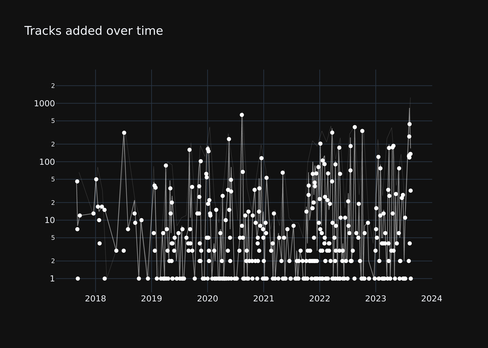
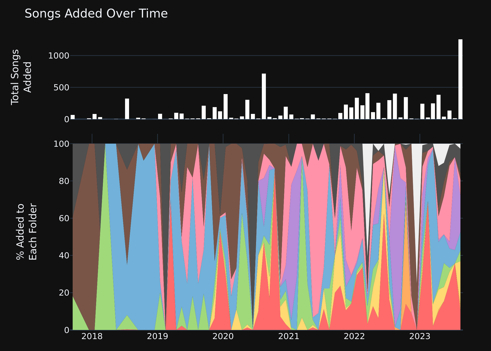
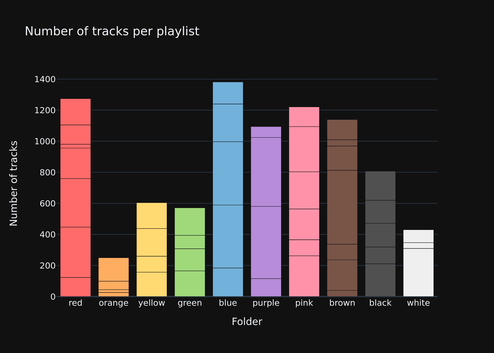
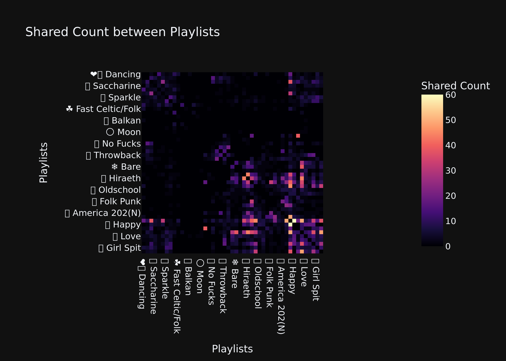
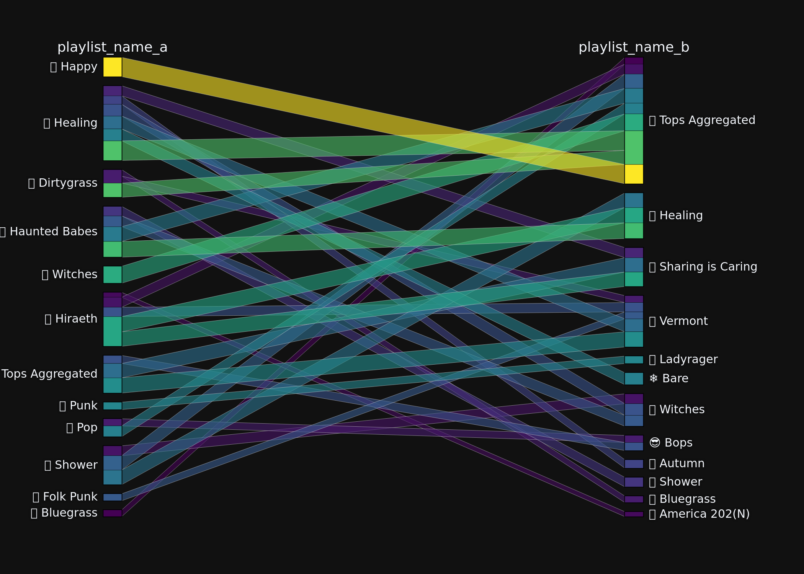
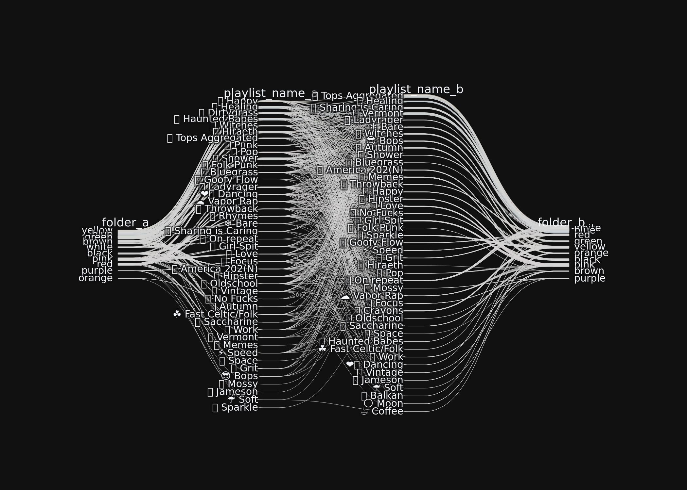
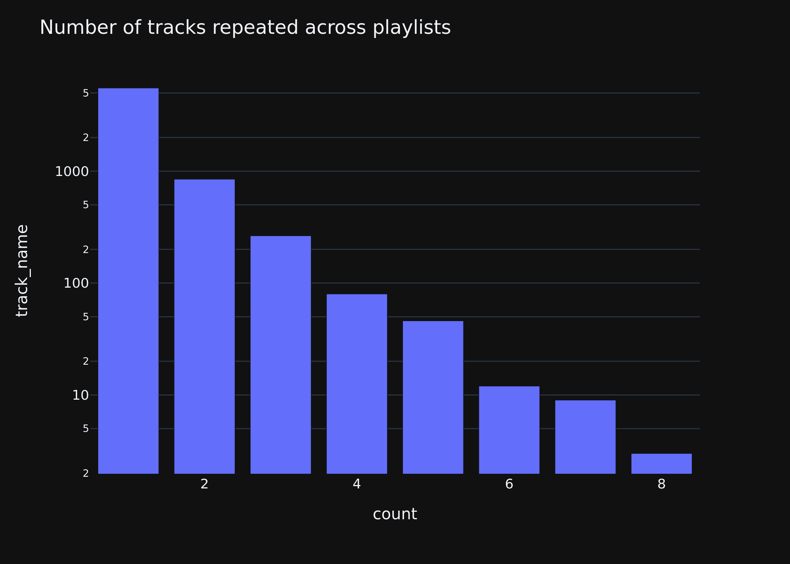

# Spotify Playlist Overlap

## Setup

The basic file structure should be as follows:

```
├── Readme.md
├── color_mapping.json # Edit these to the colors you want for your folders
├── folder_mapping.json # Spotify API doesn't allow pulling folders so I made a manual fuzzy match instead
├── module
│   ├── __init__.py
│   └── functions.py # TODO: break this up into data processing, visualization
├── requirements.txt
└── venn.ipynb
```

Authenticate using your Spotify Developer Credentials

`auth_manager = f.auth_call()`

This will give you a link to open in a browser. Sign in to your Spotify account. It will then route you to a seemingly broken page (localhost). Note that all your credentials and whatnot should be in a .env file like so (note no variables should have quotes around them):

```
CLIENT_ID=<YOUR CLIENT ID>
CLIENT_SECRET=<YOUR CLIENT SECRET>
REDIRECT_URI=http://localhost:8080
```

Copy that localhost address from your browser (contains params with special codes) and paste into the box brought up by this command:

`sp = f.auth_response(auth_manager)`

## Download

Download & cache data. Genres and audio features are pending (Spotify doesn't like this many API calls, even with backoffs) so we keep these `False` for now.

`df = f.download_data(sp, fetch_genres=False, fetch_audio_features=False)``

# Visualize

Show tracks added over time:

`f.make_timeline(df)`



Show tracks added over time by folder:

`f.make_folder_stacked_timeline(df)`



Show track counts per folder, divided by playlist

`f.make_folder_bars(df)`



Show co-occurrence heatmap

`f.plot_shared_count_heatmap(df=df)`



Plot sankey:

`f.plot_thresholded_parcats(df=df, show_folders=True).show()`



Parallel Categories:

`f.plot_parallel_categories(df=df).show()`



Track Repeat Analysis:

`f.track_repeat_analysis(df=df).show()`

